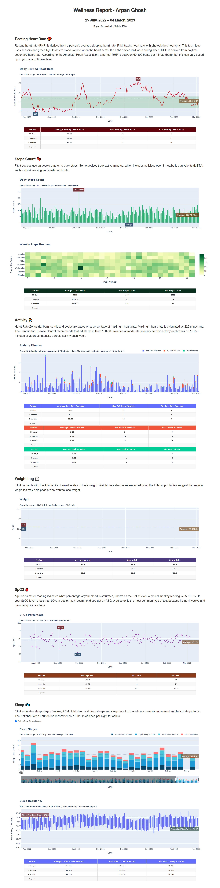

<h1>Fitbit Wellness Report Web UI</h1>
by Arpan Ghosh
  
 

 

## Building

This app takes no build arguments. To build the container:

`docker build -t fitbit-web-ui fitbit-web-ui-app/`

## Configuration

The variables `CLIENT_ID`, `CLIENT_SECRET`, and `REDIRECT_URL` need to be set to self-host this application. Instructions for getting these values can be found [here](https://dev.fitbit.com/build/reference/web-api/developer-guide/getting-started/).

## Contributions

Thanks to [@arpanghosh8453](https://github.com/arpanghosh8453) for sharing their work on the Fitbit API and the report design, and for sharing this project with the world.

Special thanks to [@dipanghosh](https://github.com/dipanghosh) for his help and contribution towards the sleep schedule analysis part of the script and overall aesthetics suggestions. 
